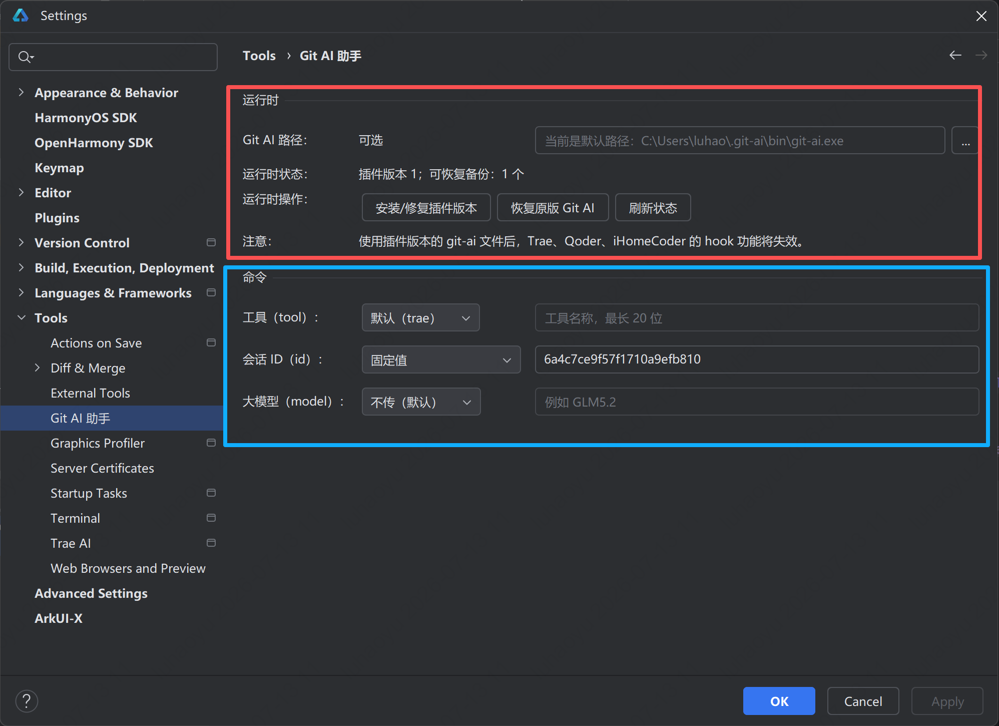
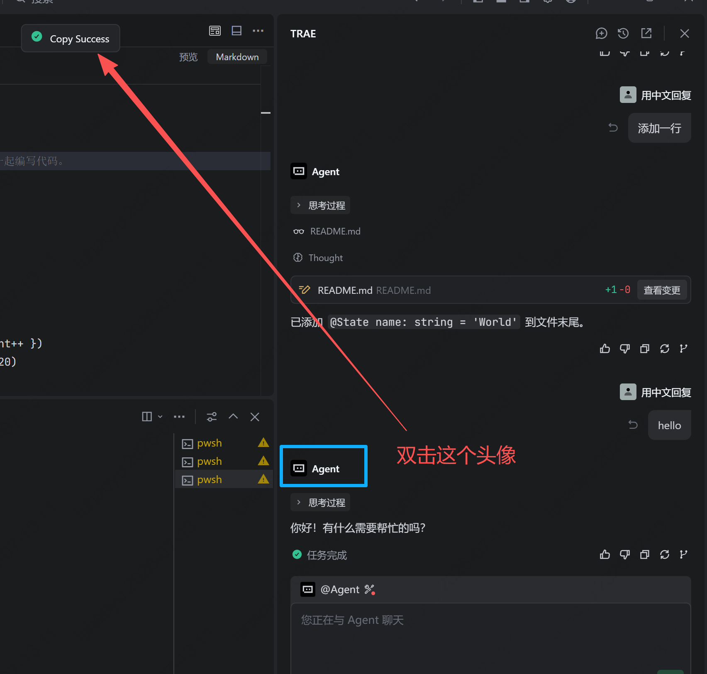
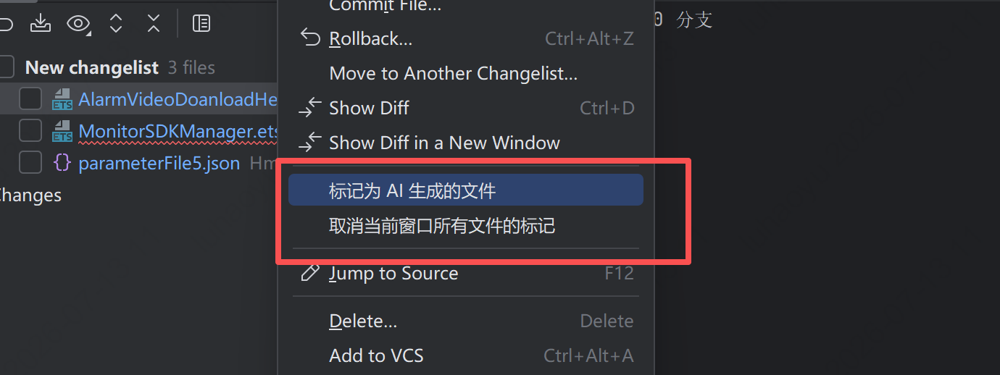
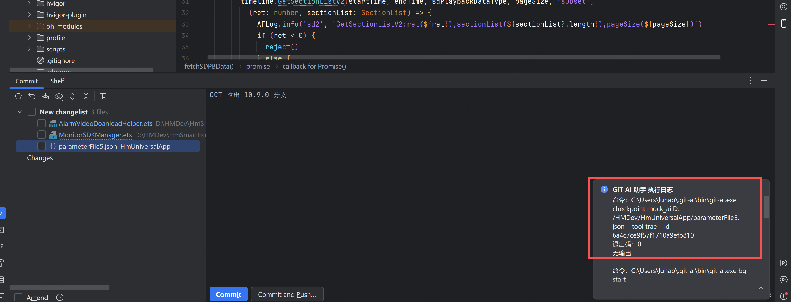

## Git AI 助手使用说明

### 插件介绍
该插件在代码未提交之前，将“人工”写的代码，直接打上 AI 标签。也可以将 AI 写的代码，移除 AI 标签。整个过程没有 AI 会话操作。

### 安装插件

目前暂时仅支持 IntelliJ IDEA 系列的软件，安装插件前，请确保先安装好公司的“行业统计工具”。

### 使用

#### 插件设置

在 IntelliJ IDEA 中，点击菜单栏的 `File` -> `Settings`(MacOS 为 `IntelliJ IDEA` -> `Preferences`) -> `Tools` ->
`Git AI 助手`，插件设置界面如下图所示：



##### 运行时设置

首次使用插件时，需要先安装插件所提供的 `git-ai.exe`，该操作会将行业统计工具的 `git-ai.exe` 替换为插件提供的 `git-ai.exe`。如果想要恢复行业统计工具的 `git-ai.exe`，可以在插件设置界面点击 `恢复原版 AI` 按钮。

##### 命令设置（可选）

主要关注会话 ID 的设置，默认会话 ID 为随机生成，该会话 ID 用于标识 Trae 或者 Qoder 中的会话，每次会话时 Trae 或者 Qoder 都会随机生成一个 会话 ID，这个会话 ID 会上传到 Trae 的后台管理中。

目前建议先选择一个真实的 Trae 的会话 ID，也可以默认随机生成一个会话 ID。

有两种方式可以查看 Trae 的会话 ID：
1、在 Trae 个人中心的 `使用记录` 页面可以查看当前用户的所有会话 ID。[点我查看个人使用记录](https://console.enterprise.trae.cn/personal/usage)


2、在 Trae 的对话窗口中，双击AI的头像，会将一串 id 复制到剪贴板中。



复制成功后，你会得到如下的内容：

```
.349991936:8a9253b308c2482671285afa3f0e783e_6a51009641dcea6433c175dc.6a545b54766bcf1d0e952d3c.6a545b544526864e89304195:Trae CN.T(2026/7/13 11:28:20)
```

其中最后一段 `6a545b544526864e89304195` 就是当前会话的 ID。

#### 文件打标

在 IntelliJ IDEA 中的 `Commit` 窗口中，选中需要打标的文件，右键会有两个选项：

1. 标记为 AI 生成的代码：
- 选中的是文件：将文件中当前的增量代码都打上 AI 标签。
- 选中的是目录：将选中的目录下的所有文件的增量代码都打上 AI 标签。

2. 取消当前窗口所有文件的标记：该选项会将当前窗口中所有文件的增量代码的 AI 标签还原。



打完标签后的日志在右侧，打标成功后的日志如下：



## 已知风险（SessionId 反查风险）

随机生成的 sessionId，如果在 Trae 或者 Qoder 中反查 sessionId，是无法查询到具体的会话记录。即使你使用一个真实的 Trae 或者 Qoder 的 sessionId，后台记录的代码修改文件也无法与你真实的修改文件对应起来。

## 已知问题

### 1、安装运行时候，直接打标不成功。
解决方法：建议重启 IDEA 后再尝试打标。

### 2. 插件安装后，在 `Trae` 和 `Qoder` 的 Hook 功能失效。
解决方法：插件的 git-ai 与行业统计工具的 git-ai 冲突，如果想要使用 Trae 或者 Qoder 的 Hook 功能，请在插件设置界面点击 `恢复原版 AI` 按钮，恢复行业统计工具的 git-ai。

### 3. 打标后，使用 `git ai stats HEAD --json` 查询不到 BYAC 数据
解决方法：这是正常现象，插件所提供的 git-ai.exe 暂时不支持使用这个命令查询 BYAC 数据。建议使用 `git notes --ref=ai show HEAD` 查询增量代码的 AI 标签。
